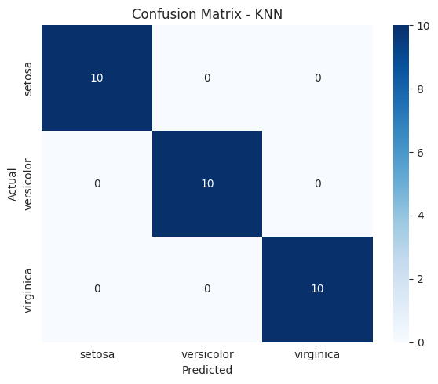

# Iris Flower Classification

## About
This project was completed as part of my Data Science internship at CodeAlpha.

## Problem Statement
Classify Iris flowers into one of three species (setosa, versicolor, virginica) based on their sepal and petal measurements.

## Dataset
Built-in Iris dataset from scikit-learn (`sklearn.datasets.load_iris`) — 150 samples, 4 features (sepal length/width, petal length/width), 3 balanced classes (50 each).

## Approach
- Data loading and exploration (no missing values, perfectly balanced classes)
- Visualization: pairplot, feature distributions, correlation heatmap
- Train/test split (80/20, stratified)
- Trained and compared 3 models: Logistic Regression, K-Nearest Neighbors, Decision Tree
- Evaluated with accuracy, confusion matrix, and classification report

## Results
- Logistic Regression: 96.67% accuracy
- **KNN: 100% accuracy (best model)**
- Decision Tree: 93.33% accuracy
- Petal length and petal width were the most important features for separating species

## Tools Used
Python, pandas, scikit-learn, matplotlib, seaborn

## How to Run
1. Clone this repo
2. Install requirements: `pip install -r requirements.txt`
3. Open `notebook/iris_flower_classification.ipynb` in Jupyter or Google Colab
4. Run all cells

## Video Explanation
[Add your LinkedIn video link here after posting]
